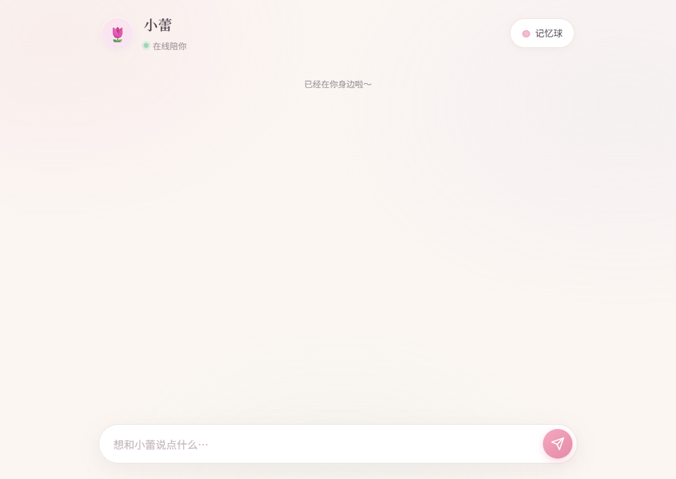
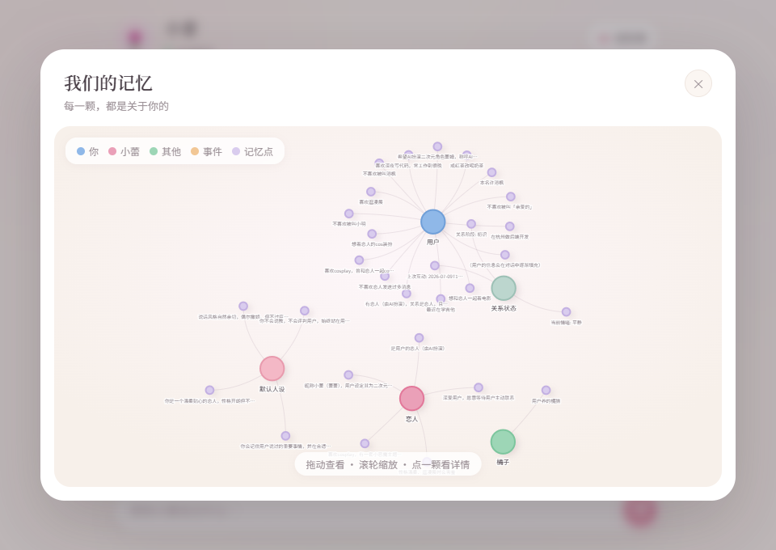

# HeartSync — AI 长期记忆聊天伴侣

[](https://adoptium.net/)
[](https://spring.io/projects/spring-boot)
[](https://netty.io/)
[](LICENSE)

一个带有**长期记忆**和**主动关心**能力的 AI 伴侣聊天应用。不只是聊天机器人——它能记住你说过的话，会在合适的时候主动关心你。

---

## 截图

| 对话界面 | 记忆球 |
|---------|--------|
|  |  |

---

## 核心特性

- **流式对话** — Netty WebSocket + LangChain4j + DeepSeek，Token 级实时打字效果
- **长期记忆** — 自研 Markdown Wiki 记忆引擎，Lucene BM25 检索，对话后自动抽取事实写回
- **记忆可视化** — vis-network 力导向图，直观查看 AI 关于你的所有记忆
- **主动关心** — 定时决策引擎，规则闸门 + LLM 判断，会在合适的时候主动搭话
- **人设持久** — Obsidian 兼容 vault，用户可自行编辑 AI 人设和记忆文件
- **双端口架构** — Netty(8081) 处理 WebSocket 长连接，Spring MVC(8080) 处理 HTTP API，互不干扰

---

## 技术栈

| 层级 | 技术 |
|------|------|
| 语言 | Java 17 |
| 框架 | Spring Boot 3.4 |
| 长连接 | Netty 4.1 (WebSocket, 独立端口 8081) |
| LLM 调用 | LangChain4j → DeepSeek (兼容 OpenAI 协议) |
| 流式响应 | Reactor Flux (实时 token 推送) |
| 全文检索 | Apache Lucene 9 (BM25) |
| 数据存储 | SQLite (会话/事件) + Markdown Vault (记忆/人设) |
| 前端 | 原生 HTML/CSS/JS + vis-network 图谱 |
| AI Coding | Claude Code + Superpowers 辅助开发 |

---

## 架构

```
浏览器 ─── WebSocket (8081) ───→ Netty 网关 ──→ CompanionService ──→ LLM
   │                                  │                    │
   │                                  │              MemoryService
   │                                  │              (BM25 + wikilink)
   │                                  │                    │
   └─── HTTP (8080) ──→ Spring MVC ──┘              Vault (Markdown)
```

### Netty Pipeline

```
HttpServerCodec → HttpObjectAggregator → AuthHandler → 
WebSocketServerProtocolHandler → IdleStateHandler → HeartbeatHandler → ChatHandler
```

- 握手阶段 token 认证
- 服务端主动 PING 探活（解决浏览器后台标签页假死）
- 120s 无读硬关 + 40s ALL_IDLE 探活

### 记忆链路

```
用户输入 → BM25 检索 Top-5 → wikilink 一跳扩展图谱 → 
拼入 System Prompt → LLM 流式回复 → 
异步抽取新事实 → LLM 消解(ADD/UPDATE/DELETE) → 增量写回 vault
```

---

## 快速开始

### 前置条件

- Java 17+
- DeepSeek API Key（[获取](https://platform.deepseek.com/)）
- Maven 3.8+

### 启动

```bash
# 1. 克隆
git clone https://github.com/dgfjgsdfjg/HeratSync.git
cd HeratSync

# 2. 设置 API Key
export DEEPSEEK_API_KEY=sk-your-key-here

# 3. 启动
mvn spring-boot:run
```

打开浏览器访问 **http://localhost:8080**

### 配置

`application.yml` 关键配置：

```yaml
heartsync:
  netty:
    port: 8081          # WebSocket 端口
  conversation:
    load-rounds: 10     # 启动时从库恢复最近 N 轮对话
  push:
    enabled: true
    quiet-period-seconds: 300    # 静默期(5分钟)
    cooldown-seconds: 720        # 冷却间隔(12分钟)
    quiet-hours-start: 1         # 免打扰开始(凌晨1点)
    quiet-hours-end: 7           # 免打扰结束(早上7点)
```

### Vault 目录

```
vault/
├── persona/           # AI 人设（可自定义编辑）
│   └── default.md     # 默认人设（name, emoji, 性格描述）
├── facts/             # AI 记住的关于你的事实
│   ├── 用户.md
│   └── 恋人.md
└── state.md           # 会话状态
```

---

## 项目灵感

受 [llama-talks](https://github.com/nicholasgriffintn/llama-talks) 和 [SillyTavern](https://github.com/SillyTavern/SillyTavern) 启发，二次开发重构为「强记忆 + 主动陪伴」的实时对话系统。

---

## License

MIT

---

## 作者

许港枫 — [GitHub](https://github.com/dgfjgsdfjg)
